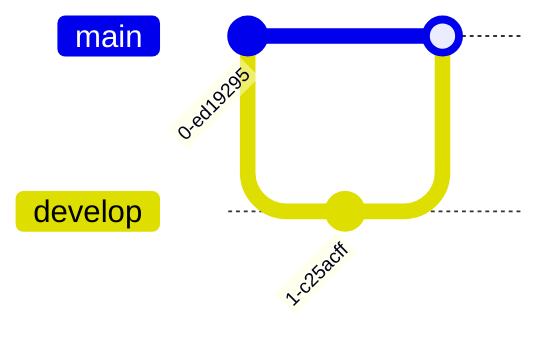

Voici **un fichier Markdown prêt à l’emploi**, que tu peux déposer tel quel dans un repo ou une doc (`mermaid-diagrams-reference.md`).
Il couvre **tous les types de diagrammes Mermaid courants**, avec pour chacun : nom, utilité claire, et un exemple minimal fonctionnel.

---

````markdown
# Référence complète des diagrammes Mermaid

Ce document présente les principaux types de diagrammes supportés par Mermaid.
Pour chaque type :

- ce que c’est
- quand l’utiliser
- un exemple minimal fonctionnel

---

## 1. Flowchart

### Description

Diagramme de flux logique. C’est le plus utilisé.  
Il sert à représenter un processus, une suite d’étapes ou une logique conditionnelle.

### Cas d’usage

- workflow métier
- pipeline de traitement
- logique conditionnelle
- algorithme simple

### Exemple


````

---

## 2. Sequence Diagram

### Description

Diagramme temporel montrant les échanges entre acteurs, dans l’ordre chronologique.

### Cas d’usage

- appels API
- échanges client / serveur
- scénarios utilisateurs
- protocoles

### Exemple


---

## 3. Class Diagram

### Description

Diagramme orienté objet.
Il décrit des classes, leurs attributs, méthodes et relations.

### Cas d’usage

- conception logicielle
- modélisation de données
- documentation technique

### Exemple


---

## 4. State Diagram

### Description

Diagramme d’états finis.
Il montre les états possibles d’un système et les transitions.

### Cas d’usage

- machine à états
- workflow avec statuts
- logique métier complexe

### Exemple


---

## 5. Entity Relationship Diagram (ERD)

### Description

Diagramme de relations entre entités de base de données.

### Cas d’usage

- modélisation de schéma SQL
- conception de bases de données
- documentation data

### Exemple


---

## 6. Gantt

### Description

Diagramme de planification temporelle.

### Cas d’usage

- gestion de projet
- roadmap
- planning de développement

### Exemple


---

## 7. Pie Chart

### Description

Diagramme circulaire de répartition.

### Cas d’usage

- répartition de coûts
- statistiques simples
- ratios

### Exemple


---

## 8. Journey Diagram

### Description

Diagramme de parcours utilisateur avec ressenti.

### Cas d’usage

- UX
- expérience client
- parcours utilisateur

### Exemple


---

## 9. Requirement Diagram

### Description

Diagramme de gestion des exigences (inspiré SysML).

### Cas d’usage

- cahier des charges
- exigences fonctionnelles
- traçabilité

### Exemple

```mermaid
requirementDiagram
    requirement Req1 {
        id: R-001
        text: Le système doit être sécurisé
        risk: high
        verifymethod: test
    }
```

---

## 10. Git Graph

### Description

Visualisation de l’historique Git.

### Cas d’usage

- documentation Git
- stratégie de branches
- formation

### Exemple



---

## 11. Mindmap

### Description

Carte mentale hiérarchique.

### Cas d’usage

- brainstorming
- structuration d’idées
- réflexion stratégique

### Exemple


---

## 12. Timeline

### Description

Ligne du temps événementielle.

### Cas d’usage

- historique
- roadmap stratégique
- chronologie

### Exemple


---

## 13. C4 Diagram (niveau supporté par Mermaid)

### Description

Diagrammes d’architecture logicielle simplifiés (inspirés du modèle C4).

### Cas d’usage

- architecture applicative
- documentation système
- vision macro

### Exemple


---

## Notes importantes

- Mermaid est interprété par GitHub, GitLab, Obsidian, MkDocs, Docusaurus, etc.
- Tous les exemples sont volontairement simples et robustes.
- Évite les diagrammes trop complexes dans un seul bloc : découpe.

---

## Référence officielle

[https://mermaid.js.org](https://mermaid.js.org)

```

---

Si tu veux, je peux maintenant :
- te faire **une version orientée “architecture logicielle” uniquement**,
- ou **une version orientée “process métier / organisation”**,
- ou **un repo Git minimal avec ce fichier + exemples validés GitHub**.
```
