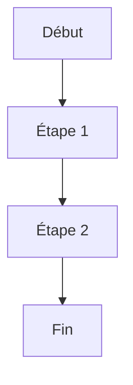
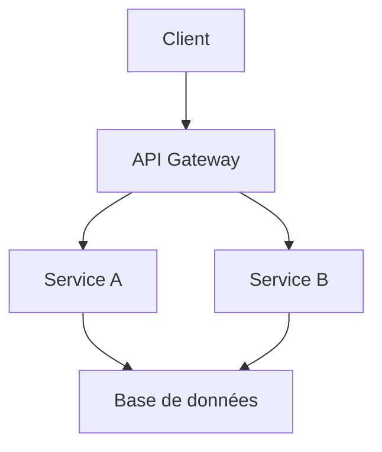

# Guide de rédaction Markdown pour MD2PDF

Ce guide vous accompagne dans la rédaction de documents Markdown optimisés pour la conversion en PDF professionnel via MD2PDF.

---

## Qu'est-ce que MD2PDF ?

MD2PDF est un convertisseur qui transforme vos fichiers Markdown en documents PDF professionnels. Il prend en charge :

- Les titres hiérarchisés et numérotés automatiquement
- Les diagrammes Mermaid (convertis en images)
- Les tableaux, listes, liens et citations
- Une mise en page soignée avec page de titre, table des matières, en-têtes et pieds de page

---

## Structure d'un document

### Titre principal

Chaque document doit commencer par un titre de niveau 1 (`#`). Ce titre sera utilisé pour :

- La page de garde du PDF
- L'en-tête de toutes les pages

```markdown
# Mon titre de document
```

> **Attention**
> Un seul titre `#` par document. Tous les autres titres doivent utiliser `##` ou plus.

### Hiérarchie des titres

| Niveau | Syntaxe | Usage |
| ------ | ------- | ----- |
| 1 | `#` | Titre du document (unique) |
| 2 | `##` | Sections principales |
| 3 | `###` | Sous-sections |
| 4 | `####` | Sous-sous-sections (niveau maximum) |

> **Attention**
> Ne pas dépasser le niveau 4 (`####`). Les niveaux 5 et 6 ne sont pas recommandes.

### Numérotation automatique

Les titres sont numérotés automatiquement par le convertisseur. Ne jamais ajouter de numéros manuellement dans vos titres.

```markdown
## Introduction

Correct : le titre sera numéroté automatiquement (ex: "1. Introduction")
```

```markdown
## 1. Introduction

Incorrect : la numérotation manuelle créera un doublon (ex: "1. 1. Introduction")
```

---

## Sauts de page

Les sauts de page sont gérés avec la syntaxe `---` (trois tirets sur une ligne seule).

### Règles d'utilisation

- Insérer `---` avant chaque titre `##` (sauf le premier qui suit le titre principal)
- Ne pas utiliser de sauts de page ailleurs dans le document

### Exemple

```markdown
# Mon document

## Première section

Contenu de la première section...

---

## Deuxième section

Contenu de la deuxième section...

---

## Troisième section

Contenu de la troisième section...
```

---

## Mise en forme du texte

### Gras et italique

| Effet | Syntaxe | Exemple |
| ----- | ------- | ------- |
| Gras | `**texte**` | **texte en gras** |
| Italique | `*texte*` | *texte en italique* |
| Gras et italique | `***texte***` | ***texte en gras italique*** |

### Listes à puces

Utiliser le tiret `-` pour les listes à puces. Un seul niveau d'imbrication est autorisé.

```markdown
- Premier élément
- Deuxième élément
  - Sous-élément (niveau max)
- Troisième élément
```

### Listes numérotées

```markdown
1. Premier élément
2. Deuxième élément
3. Troisième élément
```

---

## Tableaux

Utiliser la syntaxe Markdown standard avec les barres verticales (`|`).

```markdown
| Colonne 1 | Colonne 2 | Colonne 3 |
| --------- | --------- | --------- |
| Valeur A  | Valeur B  | Valeur C  |
| Valeur D  | Valeur E  | Valeur F  |
```

> **Attention**
> Les cellules fusionnées ne sont pas prises en charge. Chaque cellule doit être indépendante.

---

## Blocs de code

Encadrer le code avec trois backticks et indiquer le langage.

````markdown
```python
def hello():
    print("Hello, World!")
```
````

> **Note**
> Tout contenu technique contenant des `#` (commentaires, annotations) doit être placé dans un bloc de code pour éviter qu'il soit interprété comme un titre.

---

## Liens

Utiliser la syntaxe Markdown standard pour les liens.

```markdown
[Texte du lien](https://example.com)
```

> **Attention**
> Les liens nus (URLs sans texte) ne sont pas autorisés. Toujours encadrer l'URL avec un texte descriptif.

---

## Citations et encadrés

### Citation simple

```markdown
> Ceci est une citation.
```

### Encadrés sémantiques

Utiliser les conventions suivantes pour les notes, avertissements et exemples :

```markdown
> **Note**
> Information complémentaire utile au lecteur.
```

```markdown
> **Attention**
> Avertissement important à ne pas ignorer.
```

```markdown
> **Exemple**
> Illustration concrète du propos.
```

---

## Diagrammes Mermaid

MD2PDF convertit automatiquement les diagrammes Mermaid en images PNG intégrées au PDF.

### Syntaxe

````markdown
### Titre du diagramme


````

### Règles

- Chaque diagramme doit être précédé d'un titre `###`
- Un seul diagramme par bloc de code
- Utiliser la syntaxe Mermaid standard

### Types de diagrammes supportés

- Flowchart (`graph TD`, `graph LR`)
- Sequence diagram (`sequenceDiagram`)
- Class diagram (`classDiagram`)
- State diagram (`stateDiagram-v2`)
- Entity Relationship (`erDiagram`)
- Gantt (`gantt`)
- Pie chart (`pie`)

---

## Métadonnées du document

Les métadonnées (titre, auteur, date, version, organisation) sont saisies dans l'interface MD2PDF, pas dans le fichier Markdown.

> **Attention**
> Ne pas inclure de cartouche de métadonnées en début de document. Si vous devez conserver des notes techniques, placez-les dans un bloc de code.

---

## Récapitulatif des interdictions

| Interdit | Raison |
| -------- | ------ |
| HTML brut | Non interprété par le convertisseur |
| CSS inline | Non supporté |
| Emojis | Rendu incohérent dans le PDF |
| Liens nus | Mauvaise lisibilité |
| Numérotation manuelle des titres | Doublon avec la numérotation automatique |
| Titres au-delà de `####` | Non supporté |
| Listes imbriquées sur plus d'un niveau | Rendu incorrect |
| Cellules fusionnées dans les tableaux | Non supporté |
| Blocs de code dans les citations | Non supporté |

---

## Exemple de document complet

```markdown
# Rapport d'analyse technique

## Introduction

Ce document présente l'analyse technique du projet X.

L'objectif est de définir l'architecture cible et les choix technologiques.

---

## Contexte

### Situation actuelle

Le système actuel présente plusieurs limitations :

- Performance insuffisante
- Maintenance difficile
- Scalabilité limitée

### Objectifs

| Objectif | Priorité | Échéance |
| -------- | -------- | -------- |
| Performance | Haute | T1 |
| Maintenabilité | Moyenne | T2 |
| Scalabilité | Haute | T1 |

---

## Architecture proposée

### Vue d'ensemble



### Composants

Le système sera composé de trois couches principales :

- **Présentation** : interface utilisateur web
- **Métier** : services backend
- **Données** : base de données relationnelle

> **Note**
> L'architecture microservices permet une évolution indépendante de chaque composant.

---

## Conclusion

L'architecture proposée répond aux objectifs définis. La mise en oeuvre pourra débuter après validation.
```

---

## Ressources

- [Syntaxe Markdown CommonMark](https://commonmark.org/)
- [Documentation Mermaid](https://mermaid.js.org/)

---

## Support

Pour toute question ou problème, contacter le support MD2PDF.
